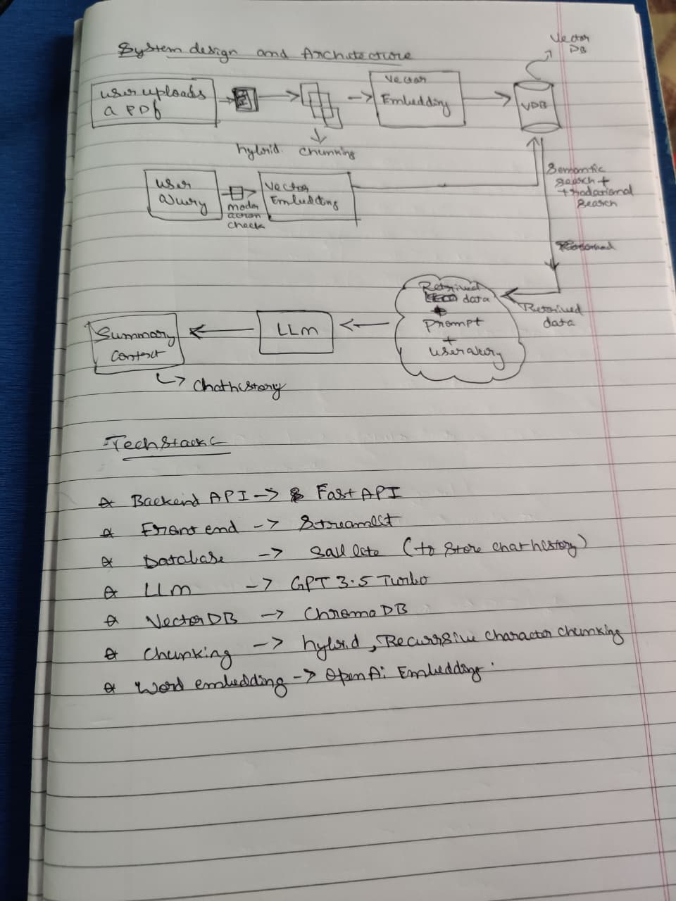
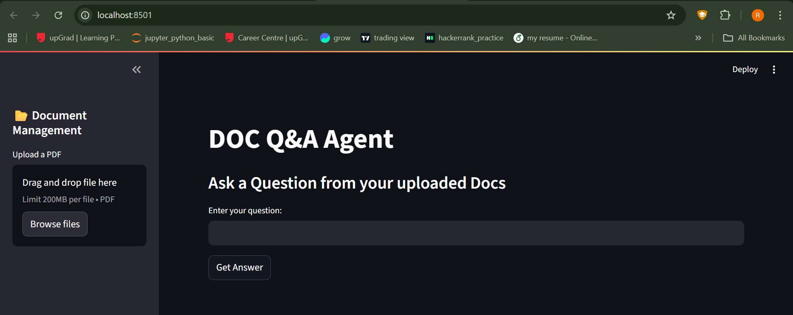
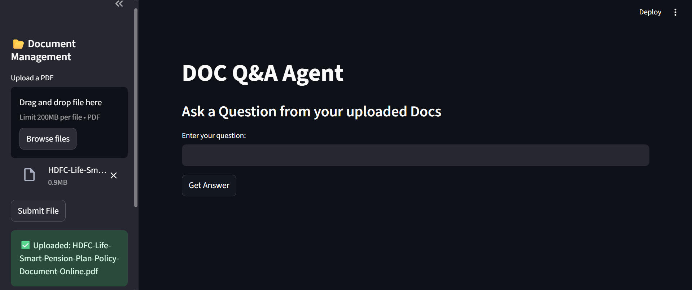
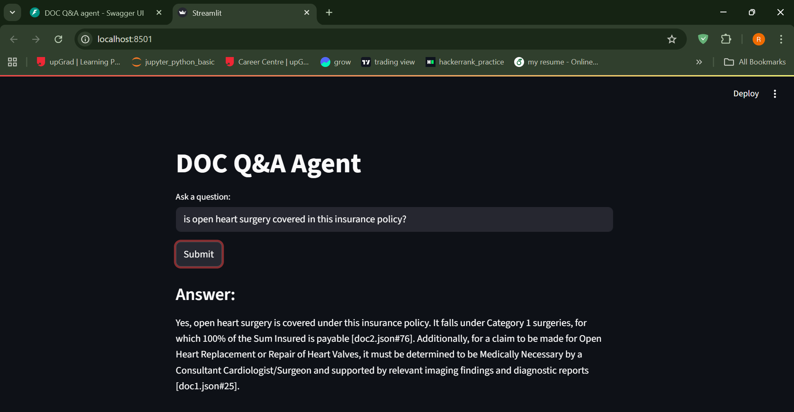
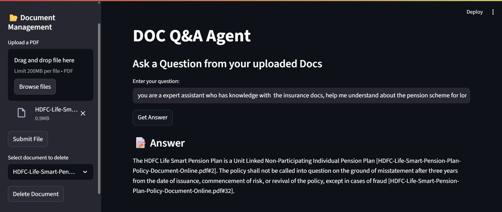

# 📘 Document Q&A Agent  

An intelligent question-answering system for PDF documents using **FastAPI, OpenAI embeddings, and Pinecone**.  
This project allows you to upload a PDF, automatically process its content into chunks, and then ask natural language questions about it. The system retrieves the most relevant chunks and generates accurate answers.  

---

##  Features  
-  Upload and process PDF documents via API  
-  Automatic text extraction, chunking, and metadata storage  
-  Semantic search powered by embeddings  
-  Ask natural language questions and receive context-aware answers  
-  Built with **FastAPI** for scalable backend APIs  
-  Ready for deployment on AWS / Azure  

---

##  Tech Stack  
- **Backend:** FastAPI, Python  
- **Document Processing:** pdfplumber, PyPDF2  
- **Embeddings & LLM:** OpenAI API  
- **Vector Database:** Pinecone (for storing & retrieving embeddings)  
- **Deployment (future):** AWS, Azure  

## Project Structure  

document_Q-A_agent/
│── .env                        # API keys (OpenAI, DB credentials, etc.)
│── .gitignore                  # Ignore .env, __pycache__, etc.
│── requirements.txt            # Python dependencies
│── README.md                   # Project documentation
│── dockerfile                  # (Optional) for containerization
│── config.yaml                 # (Optional) central config (chunk size, top_k)
│
├── backend/
│   ├── api/
│   │   ├── __init__.py
│   │   ├── ingestion.py        # Endpoint for PDF upload & processing
│   │   ├── query.py            # Endpoint for user queries
│   │   └── chat_history.py     # Endpoint for retrieving/storing chat history
│   │
│   ├── core/
│   │   ├── __init__.py
│   │   ├── chunking.py         # Hybrid recursive character splitter
│   │   ├── embeddings.py       # OpenAI embeddings logic
│   │   ├── vectordb.py         # ChromaDB wrapper
│   │   ├── llm_chain.py        # LangChain ConversationalRetrievalChain setup
│   │   └── utils.py            # Logging, helpers
│   │
│   └── main.py                 # FastAPI entrypoint
│
├── frontend/
│   ├── app.py                  # Streamlit UI
│   └── components/             # Custom UI widgets if needed
│
├── data/
│   ├── uploaded_pdfs/          # Temporary storage of PDFs
│   └── chromadb/               # Local vector DB persistence
│
└── db/
    ├── chat_history.db         # SQLite database (local dev)
    └── migrations/             # (If you later move to Postgres)

---

Future enhancements

1. storing chat history 
2. Track API usage & cost monitoring via LangServe
3. User authentication & access control

### System Design

##  Demo

### Main screen

### Upload docx

### Ask Question

### Agent response

